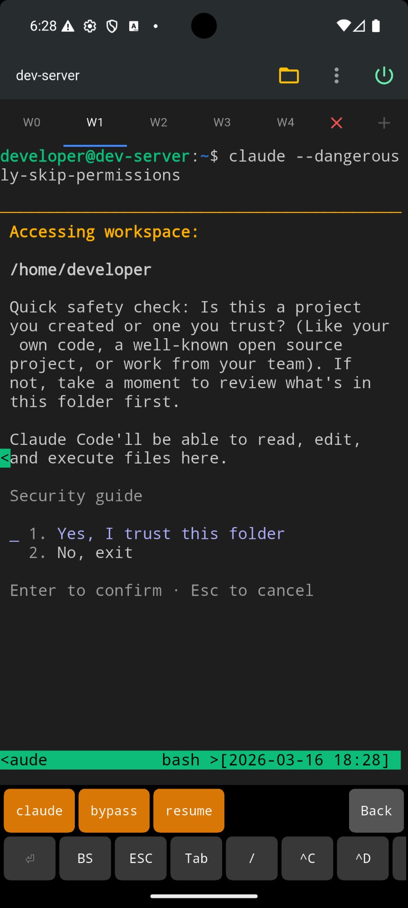
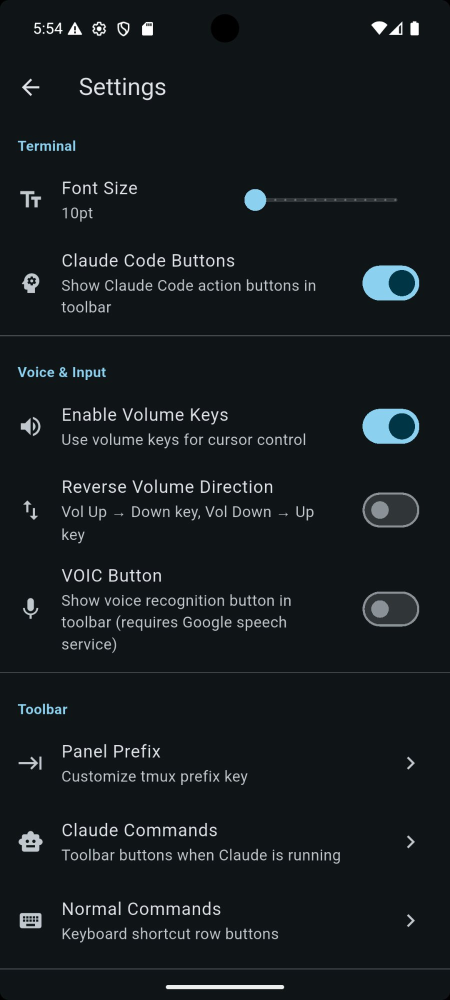
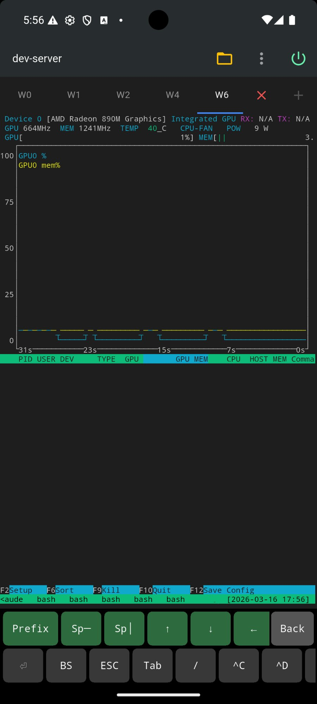
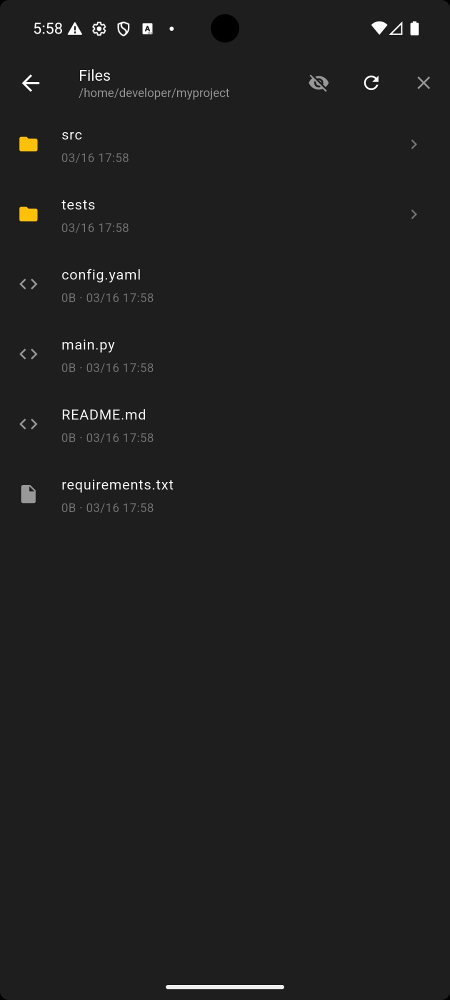
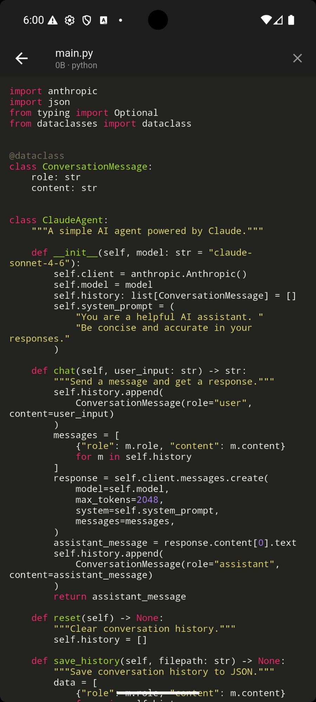
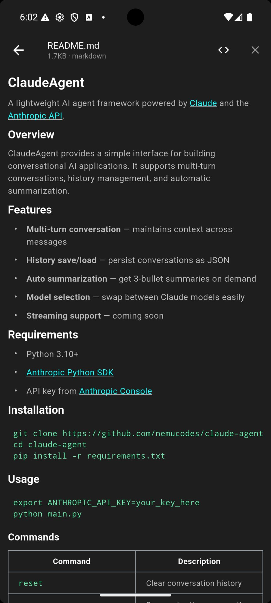
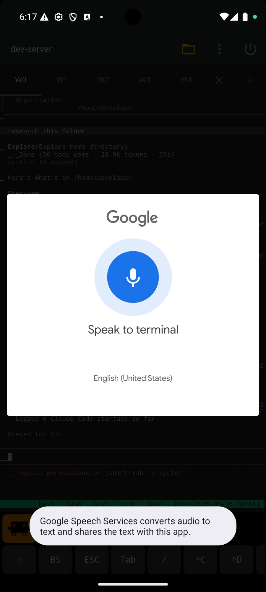

<p align="center">
  
</p>

<h1 align="center">ZenTerm</h1>

<p align="center">
  <strong>SSH terminal for Android, built for Claude Code and AI developers</strong>
</p>

<p align="center">
  <a href="#features">Features</a> •
  <a href="#screenshots">Screenshots</a> •
  <a href="#recommended-setup">Setup</a> •
  <a href="#download">Download</a> •
  <a href="PRIVACY_POLICY.md">Privacy Policy</a>
</p>

<p align="center">
  <a href="README_ja.md">日本語</a>
</p>

---

Most SSH clients were built for quick server check-ins. ZenTerm was built for developers who SSH into a remote machine to run AI agents, review outputs, and stay in flow — without a laptop.

We wanted an app that actually takes advantage of tmux, not one that just happens to work with it.

## Features

### Volume Buttons → Cursor Keys

The single biggest friction in mobile terminal work is cursor movement. ZenTerm maps your volume buttons to arrow keys — configurable direction, long-press support. Navigate Claude Code menus and command history without an external keyboard.

### Built for Claude Code

- Auto-detect when Claude Code is running — toolbar switches automatically
- One-tap launch: `claude` / `--dangerously-skip-permissions` / `--resume`
- Customizable command buttons: `/clear`, `/new`, `/model`, `^C`, `^D` and more
- True 256-color + truecolor support

### Tmux-Native Workflow

- Auto-creates or attaches to your existing tmux session on connect
- Multi-tab support (up to 5), each with an independent tmux window
- Pane split (horizontal / vertical), navigation, and kill from the toolbar
- **Monitor Mode**: attach to an external tmux session in read-only mode — perfect for watching long-running AI agent jobs without accidentally hitting a key
- Configurable prefix key (C-b / C-a / C-space or custom)

### SFTP File Browser

- Syntax highlighting for 20+ languages (Dart, Python, JS, Rust, Go, and more)
- Markdown rendering with toggle to source view
- Image preview with pinch-zoom (PNG / JPG / GIF / WebP)

### Voice Input

Speak commands directly to the terminal via Google Speech Services.

### Secure by Design

- SSH credentials encrypted via Android Keystore (never stored in plaintext)
- Zero analytics, zero telemetry — nothing leaves your device
- INTERNET permission only — no access to contacts, storage, or location
- Built on dartssh2 (pure Dart SSH — no native binary, no hidden network calls)

## Screenshots

<p align="center">
  
  
  
  
</p>

<p align="center">
  
  
  
  
</p>

## Recommended Setup

```
Android phone or tablet
     ↓ SSH over Tailscale
Your home PC / dev server (with tmux installed)
     ↓
Claude Code running in tmux
```

Install [Tailscale](https://tailscale.com/) on both devices for secure, zero-config access to your home machine from anywhere — no port forwarding, no VPN setup, no exposed SSH port.

> **Note:** ZenTerm requires tmux on your remote server. Core features (multi-tab, Monitor Mode, pane management) depend on tmux integration.

## Download

<!-- Play Store badge will be added after public launch -->
**Coming soon to Google Play** — One-time purchase, no subscription.

## Support

- Issues or feedback: nemucodes@gmail.com
- Privacy Policy: [PRIVACY_POLICY.md](PRIVACY_POLICY.md)

## Tech Stack

Built with [Flutter](https://flutter.dev/) and [dartssh2](https://pub.dev/packages/dartssh2).

---

<p align="center">
  <strong>nemucodes</strong><br>
  Building tools for lazy hackers.
</p>
